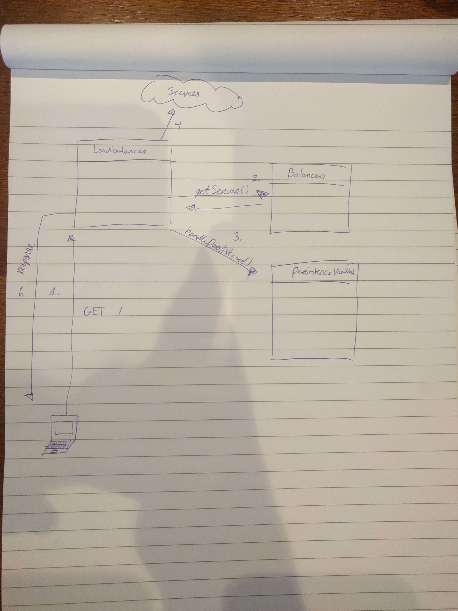

# README #
Studentnaam: Joël Christ

Studentnummer: 555468

---
# Algemene beschrijving applicatie
Een load balancer die configureerbaar is via een graphical user interface. De applicatie luistert naar een specifieke port en vind afhankelijk van de configuraties een server. De load balancer biedt de mogelijkheid om handmatig servers toe te voegen en te verwijderen, een algoritme- en persistence methode te kiezen en de naar te luisteren port in te stellen.

##  Ontwerp en bouw de *architectuur* van de applicatie die HTTP-requests van een willekeurige PC opvangt en doorstuurt naar eenn webserver. (Teken een diagram en licht de onderdelen toe)



##  Load balancing
###  Beschrijving van concept in eigen woorden
Load balancing is het verdelen van netwerk verkeer over meerdere servers door middel van een strategie/algoritme zodat het vermogen om meerdere gebruikers tegelijkertijd te behandelen bevorderd zonder dat de server performance afneemt.
###  Code voorbeeld van je eigen code
```csharp
    public interface Balancer
    {
        Server GetServer();
    }
...

    public class RoundRobinBalancer : Balancer
    {
        private static int index = 0;

        public Server GetServer()
        {
            index = index != Config.Servers.Count - 1 ? index + 1 : 0;
            Console.WriteLine("Using server with index {0}", index);
            return Config.Servers[index];
        }
    }

...

    public class RandomBalancer : Balancer
    {
        private static readonly Random random = new Random();

        public Server GetServer()
        {
            return Config.Servers[random.Next(Config.Servers.Count)];
        }
    }

...

        private void HandleClient(TcpClient client)
        {
            Server server;
            do
            {
                server = BalancerFactory.GetInstance(Config.BalanceMethod).GetServer();
            } while (!server.IsAvailable);

            var persistenceHandler = PersistenceHandlerFactory.GetInstance(Config.PersistenceMethod);

            var req = client.ReceiveData();

            if (persistenceHandler.HasPersistence(req)) {
                server = persistenceHandler.GetServer(req);
            }

			var res = RetreiveDataFromServer(req, server);
			
            if (!persistenceHandler.HasPersistence(req)) {
                res = persistenceHandler.AddPersistence(res);
            }
            client.SendData(res, true);
        }
         
```
###  Alternatieven & adviezen
In mijn load balancer zijn twee algoritmes geïmplementeerd namelijk random, geeft een willekeurige server, en round robin, geeft elke keer de volgende server in de pool. Als alternatief op deze algoritmes zou bijvoorbeeld least connection gebruikt kunnen worden. Hierbij wordt eerst bekeken hoeveel actieve connecties elke server heeft en de server met de minste connecties wordt dan gegeven. Dit had ook een goede optie zijn geweest in mijn load balancer, maar er hoefde maar twee algoritmes geïmplementeerd te worden.
###  Authentieke en gezaghebbende bronnen
https://f5.com/glossary/load-balancer

https://en.wikipedia.org/wiki/Load_balancing_(computing)

https://kemptechnologies.com/load-balancer/load-balancing-algorithms-techniques/

##  Server persistence
###  Beschrijving van concept in eigen woorden
Server persistence is het gebruik van een en dezelfde server. Hierdoor behoudt de gebruiker zijn sessie met een server namelijk degene waar de sessie begon. 
###  Code voorbeeld van je eigen code
```csharp
    public static class PersistenceHandlerFactory
    {
        public static PersistenceHandler GetInstance(PersistenceMethod method) {
            switch (method)
            {
                case PersistenceMethod.CookieBased:
                    return new CookieHandler();
                default:
                case PersistenceMethod.SessionBased:
                    return new SessionHandler();
            }
        }
    }
    
...
    public interface PersistenceHandler
    {
        bool HasPersistence(string req);
        Server GetServer(string req);
        string AddPersistence(string res, Server server);
    }
    
...
        public class CookieHandler : PersistenceHandler
        {
            private const string COOKIE_HEADER = "Set-Cookie: LB={0}:{1}";
            private const string COOKIE_ID = "LB";
    
            public string AddPersistence(string res, Server server)
            {
                var split = res.Split(new char[] { '\r', '\n' });
                split[0] = split[0] + "\n" + String.Format(COOKIE_HEADER, server.Url, server.Port);
                return string.Join("\r\n", split);
            }
    
            public Server GetServer(string req)
            {
                var cookies = getCookies(req);
                var cookie = cookies.First(c => c.Contains(COOKIE_ID));
                var value = cookie.Split('=')[1].Split(':');
                return new Server(value[0], int.Parse(value[1]));
    
            }
    
            public bool HasPersistence(string req)
            {
                var cookies = getCookies(req);
                return cookies.Any(cookie => cookie.Contains(COOKIE_ID));
    
    
            }
    
            private string[] getCookies(string request)
            {
                return Regex.Match(request, "(?i)(?<=Cookie: )(?-i)(.*?)(?=\r\n)").Value.Split(new string[] { "; " }, StringSplitOptions.RemoveEmptyEntries);
    
            }
        }
...
        public class SessionHandler : PersistenceHandler
        {
            private const string COOKIE_HEADER = "Set-Cookie: LB={0}";
            private const string COOKIE_ID = "LB";
    
            private static int identifier = 0;
    
            private static IDictionary<int, Server> sessionTable = new Dictionary<int, Server>();
    
            public string AddPersistence(string res, Server server)
            {
                var split = res.Split(new char[] { '\r', '\n' });
                split[0] = split[0] + "\n" + String.Format(COOKIE_HEADER, identifier);
                sessionTable.Add(identifier, server);
                identifier++;
                return string.Join("\r\n", split);
            }
    
            public Server GetServer(string req)
            {
                var cookies = getCookies(req);
                var cookie = cookies.First(c => c.Contains(COOKIE_ID));
                var value = cookie.Split('=')[1];
                Server server;
                sessionTable.TryGetValue(int.Parse(value), out server);
                return server;
    
            }
    
            public bool HasPersistence(string req)
            {
                var cookies = getCookies(req);
                return cookies.Any(cookie => cookie.Contains(COOKIE_ID));
    
    
            }
    
            private string[] getCookies(string request)
            {
                return Regex.Match(request, "(?i)(?<=Cookie: )(?-i)(.*?)(?=\r\n)").Value.Split(new string[] { "; " }, StringSplitOptions.RemoveEmptyEntries);
    
            }
```
###  Alternatieven & adviezen
Een beter alternatief is natuurlijk om stateless applicaties te bouwen. In deze tijd is het niet nodig om de state van je applicatie intern bij te houden.
Dit is ook prima uit te besteden aan hiervoor geschikte datastores.

###  Authentieke en gezaghebbende bronnen
https://f5.com/resources/white-papers/cookies-sessions-and-persistence

https://www.ibm.com/support/knowledgecenter/en/SS9H2Y_7.2.0/com.ibm.dp.doc/lbg_sessionaffinity.html

https://support.kemptechnologies.com/hc/en-us/articles/202040875-Layer-7-persistence-methods

https://docs.google.com/presentation/d/14Xwnk34dMc3IIN6qe4_ZwmOXfgvq4dOFNcFk-rCHfjA/edit#slide=id.p19

##  Health monitoring
###  Beschrijving van concept in eigen woorden
Health monitoring is manier om de beschikbaarheid van een systeem (in het geval van een load balancer, een server) vast te stellen door middel van het continu in de gaten houden van netwerk verkeer en te observeren of deze voldoen aan bepaalde condities.
###  Code voorbeeld van je eigen code
```csharp
    public struct Server
    {
        public string Url;
        public int Port;
        public bool IsAvailable {
            get {
                return GetAvailibility();
            }
        }

        public Server(string url, int port) {
            this.Url = url;
            this.Port = port;
        }

        private bool GetAvailibility() 
        {
            try
            {
                HttpWebRequest httpRequest = WebRequest.CreateHttp(string.Concat("http://", Url, ":", Port));
                httpRequest.Method = "HEAD";
                httpRequest.Timeout = Config.Timeout;
                HttpWebResponse httpResponse = httpRequest.GetResponse() as HttpWebResponse;
                httpResponse?.Close();
                return true;
            }
            catch (WebException)
            {
                // exception is thrown when the server is offline or time out has exceeded
                return false;
            }
        }
    }
```
###  Alternatieven & adviezen
In mijn load balancer wordt er gebruik gemaakt van active health monitoring waarbij er actief initiatief wordt genomen door de load balancer om de condities te controleren. Een alternatief hierop zou passive health monitoring kunnen zijn waarbij de load balancer passief netwerk verkeer observeert en aan de hand hiervan de condities controleert. Hoewel passive health monitoring voor minder load op de server zou zorgen, is active health monitoring in dit geval toch beter. Omdat dit geen uitgebreide load balancer is en passive health monitoring redelijk moeilijk is om te implementeren. Dit komt doordat er op veel meer condities gecontroleerd zou moeten worden.
###  Authentieke en gezaghebbende bronnen
https://devcentral.f5.com/articles/back-to-basics-health-monitors-and-load-balancing

https://en.wikipedia.org/wiki/Network_monitoring

https://www.slac.stanford.edu/comp/net/wan-mon/passive-vs-active.html

## Kritische reflectie op eigen beroepsproduct
### Definieer kwaliteit in je architectuur, design, implementatie. 
Ik ben erg tevreden over het eindresultaat van mijn load balancer. Tijdens het ontwerpen en ontwikkelen ben ik buiten mijn 'comfort-zone' gegaan en concepten gebruikt van c# die ik nog niet hiervoor heb gebruikt. Dit zorgde ervoor dat ik naar creatievere oplossingen ging zoeken voor de problemen die ik tegen kwam.
### Geef voorbeelden.
* Het gebruik van bepaalde keywords zoals ref en out bij functie parameters.
* Het gebruik van RegEx en LINQ voor het filteren van inkomende en uitgaande data.
* Het gebruik van polymorfisme in C# zoals interfaces en abstracte classes (al wel eerder gebruikt in andere programmeertalen).
### Wat kan er beter, waarom?
Omdat ik van tevoren niet precies wist wat er werd bedoeld met cookie based persistence had ik als eerst session based persistence geïmplementeerd. Dit maakte het later lastiger om het abstract te maken zodat dezelfde opbouw gebruikt zou kunnen worden voor cookie based persistence. Hierdoor is de uiteindelijke abstracte class meer gericht op cookie- en session based persistence, wat eigenlijk niet de bedoeling was. Deze had eigenlijk zo abstract mogelijk moeten worden.
